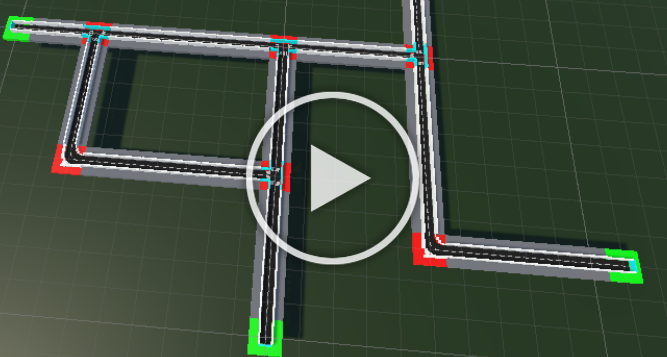
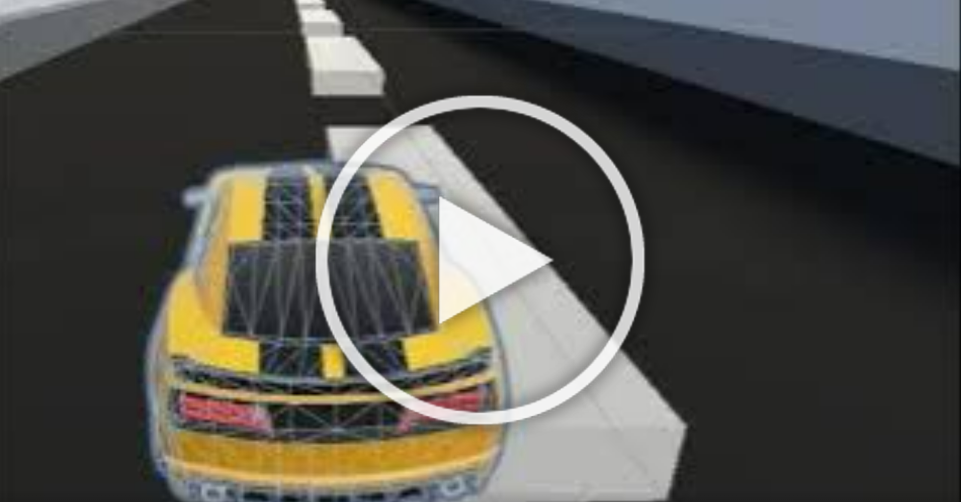

# Self-Driving-Car-Unity(Code Only)
A car that can drive from point A to point B, made in Unity! Utilizes PPO reinforcement-learning.

## Current Features
- Procedural Road Generation
- Procedural Building Generation
- Procedural Nature Generation
- A* Algorithm
- A* Algorithm Car Integration
- A* Visualization
- A* Demonstration Recorder
- ML-Agent Observations
- ML-Agent Actions

## Upcoming Tasks
- Hyperparameter Tuning

## Changelog
- 2023-03-13: Initial Commit
- 2023-08-14: Finished Project, Pushed to GitHub
- 2024-10-18: Updated README and Cleaned Repository, Rebuilt

### Procedural Generation
*Procedural Generation, Click for Compilation of Images*

The procedural generation makes use of a modified [Lindenmeyer System](https://www1.biologie.uni-hamburg.de/b-online/e28_3/lsys.html).  
Structures are disabled for performance reasons.  

### A* Grid
  
Utilizes tree-searching for efficiency. A* Grid is sized dynamically according to road network size.  

### Demonstrator

*Demonstrator in Action*

Uses the A* Algorithm in tandem with a semi-realistic car controller I made to automatically drive car from point A to point B.  
Saves demonstration to file, which can then be used to train models.